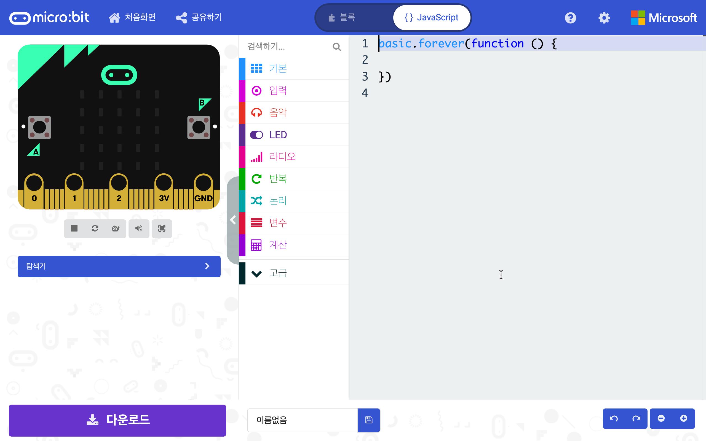
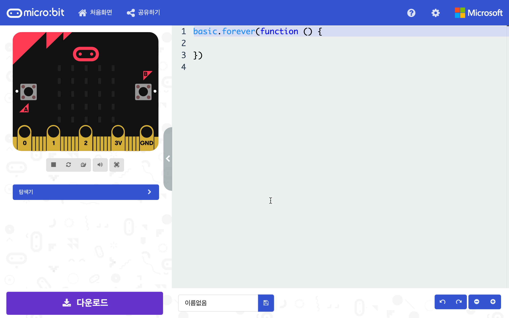

# 마이크로비트 메이크코드 자바스크립트 모드

마이크로비트 메이크코드에서 자바스크립트 모드를 확장시켜 블록 사용 없이 자바스크립트 입력만 가능하도록 하는 크롬 확장프로그램입니다.

적용 전             |  적용 후
:-------------------------:|:-------------------------:
  |  

- 자바스크립트 모드로 변경 시 블록 모드로 변경 할 수 없게 합니다.
- 자바스크립트 모드에서 코드입력으로만 사용하도록 합니다.

## 설치법

1. Clone or download(초록색 버튼)을 클릭하여 zip 파일로 다운로드 받습니다.
2. 다운로드 받은 zip 파일의 압축을 적당한 곳에 풀어줍니다.
3. 크롬 메뉴바에서 창 - 확장프로그램 으로 들어갑니다.
4. 확장프로그램 창에서 오른쪽 상단의 개발자 모드를 활성화 합니다.
5. "압축해제된 확장프로그램을 로드합니다" 를 클릭 후 압축을 풀어준 폴더를 선택해줍니다.
6. microbit change JavaScript mode 를 활성화 해줍니다.
7. 활성화 후 마이크로비트 메이크코드 접속 상태라면 새로고침을 해주세요.

## 사용법

- https://makecode.microbit.org/#editor 주소로 들어가면 자동으로 작동됩니다.
- 자바스크립트 모드 버튼을 누르면 모드 선택 버튼과 블록 선택 부분이 사라지고 코드 입력창만 남게됩니다.
- 코드 자바스크립트 모드에서 컨트롤+알트+Z 를 누르면 모드 선택 버튼이 다시 나타납니다.

## 주의사항
- 간혹 블록 모드에서 모드 선택 버튼이 사라지기도 합니다. 이럴 경우 새로고침 해주세요.
- 건의 사항이나 오류 수정은 <edu.hoon@gmail.com> 으로 해주세요.
